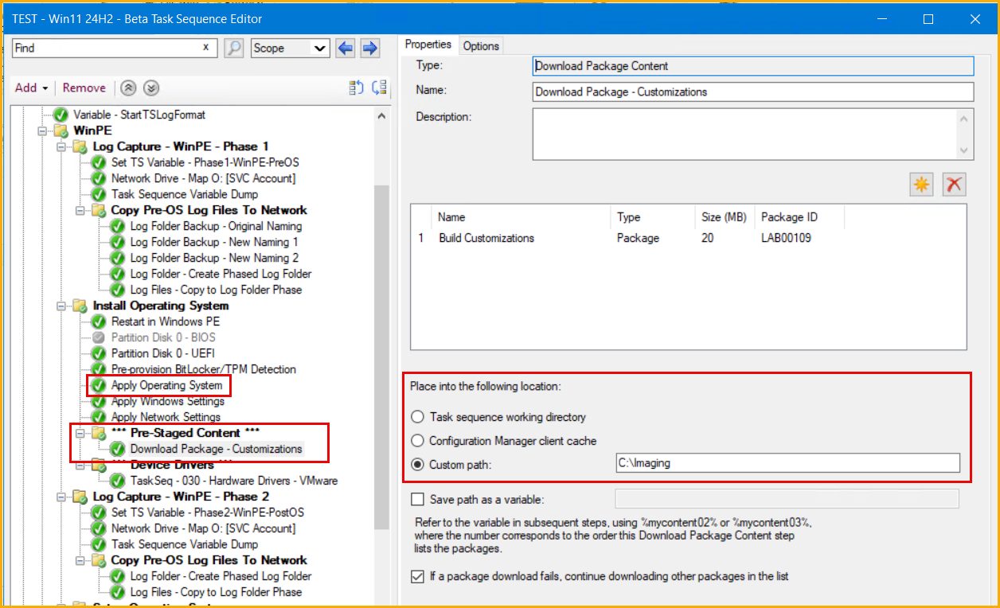

Open your task sequence and somewhere after the Apply Operating System step, create your 
Begin by opening your task sequence and creating some steps to download some packages with custom data such as:
1. File Associations
2. Icons
3. Scripts
4. Tools
5. Wallpaper


<IMAGE FILE HERE>

These packages will be staged at __C:\Program Files\Imaging__ in similarly named folders.

In your task sequence, you will need to create a step to inject a single line of registry code.
Use REG ADD or, in this case, REG IMPORT with the below snippet.
```
Windows Registry Editor Version 5.00
[HKEY_LOCAL_MACHINE\SOFTWARE\Microsoft\Active Setup\Installed Components\{20220221-0000-0000-0000-AAAAAAAAAAAA}]
@="User Desktop Customization - Desktop Background"
"StubPath"="C:\\Windows\\System32\\WindowsPowerShell\\v1.0\\Powershell.exe -ExecutionPolicy Bypass -NoProfile -File \"C:\\Program Files\\Imaging\\Scripts\\Invoke-UserBasedSettings.ps1\""
"Version"="1,0,0,0"
```


```
### "C:\Program Files\Imaging\Scripts\Invoke-UserBasedSettings.ps1" ###
[string]$fileWallpaper = 'C:\Program Files\Imaging\Wallpaper\Wallpaper.jpg'
[string]$taskName        = "Desktop Wallpaper for ${ENV:USERNAME}"
[string]$taskDescription = 'Sets the default background to the approved Wallpaper'
[string]$taskPath        = 'Imaging'
[string]$GraceSeconds    = '120'
$actionArgs = @{
    Execute          = 'C:\Windows\System32\WindowsPowerShell\v1.0\powershell.exe'
    Argument         = '-NoLogo -NoProfile -ExecutionPolicy Bypass -WindowStyle Hidden -File "C:\Program Files\Imaging\Scripts\Set-DesktopWallpaper.ps1"'
    WorkingDirectory = 'C:\Program Files\Imaging\Scripts\'
    ErrorAction      = 'Stop'
}
try {
    $action  = New-ScheduledTaskAction @actionArgs
}
catch {
    $_.Exception.Message
}

$triggerArgs = @{
    Once        = $true
    At          = (Get-Date).AddSeconds($GraceSeconds)
    ErrorAction = 'Stop'
}
try {
    $trigger = New-ScheduledTaskTrigger @triggerArgs
}
catch {
    $_.Exception.Message
}
# Set the scheduled task to delete itself 15 seconds after running
try {
    $taskSettings = New-ScheduledTaskSettingsSet -DeleteExpiredTaskAfter 00:00:15 -Compatibility:Win8 -Verbose -ErrorAction 'Stop'
}
catch {
    $_.Exception.Message
}
# Create the scheduled task
$taskScheduleArgs = @{
    Action      = $action
    Settings    = $taskSettings
    TaskName    = $taskName
    TaskPath    = $taskPath
    Trigger     = $trigger
    User        = $ENV:USERNAME
    Description = $taskDescription
    ErrorAction = 'Stop'
}
try {
    $null = Register-ScheduledTask @taskScheduleArgs
}
catch {
    $_.Exception.Message
}
```

```
### C:\Program Files\Imaging\Scripts\Set-DesktopWallpaper.ps1 ###
[string]$pathDesktopWallpaper = 'C:\Program Files\Imaging\Wallpaper\Wallpaper.jpg'

##############################
# Remove desktop image cache in registry
##############################
[string]$regPath = 'Registry::HKEY_CURRENT_USER\Control Panel\Desktop'
$null = Remove-ItemProperty -Path $regPath -Name 'TranscodedImageCache' -ErrorAction 'Ignore'

##############################
# Set Desktop Background
##############################
Add-Type -TypeDefinition @"
using System;
using System.Runtime.InteropServices;
public class Params
{
    [DllImport("User32.dll",CharSet=CharSet.Unicode)]
    public static extern int SystemParametersInfo (Int32 uAction,
                                                   Int32 uParam,
                                                   String lpvParam,
                                                   Int32 fuWinIni);
}
"@
$SPI_SETDESKWALLPAPER = 0x0014
$UpdateIniFile = 0x01
$SendChangeEvent = 0x02
$fWinIni = $UpdateIniFile -bor $SendChangeEvent
$null = [Params]::SystemParametersInfo($SPI_SETDESKWALLPAPER, 0, $pathDesktopWallpaper, $fWinIni)
```
